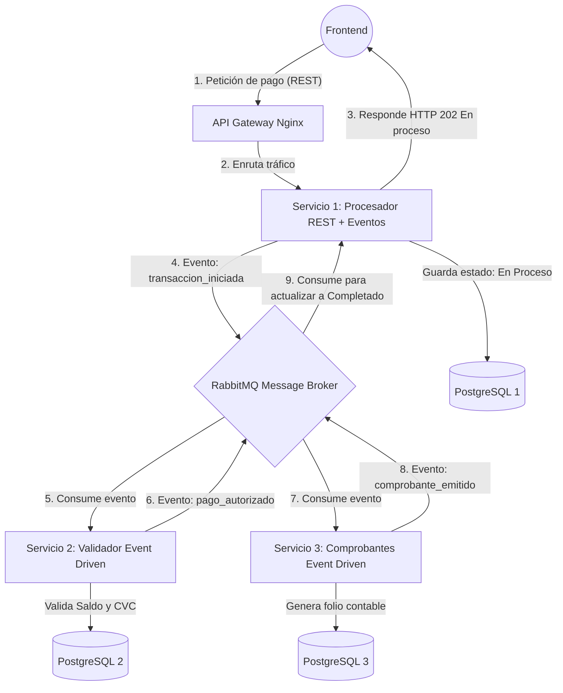

# Proyecto Final: Aplicaciones Distribuidas - Pasarela de Pagos (Fintech)

**Grupo 3**
- Andrea Navia Marín
- Cristina Cortez Escobar
- Pablo Varas Burgos
- Joshua Jara Herrera

**Máquina Virtual Asignada:** 146.83.102.22

---

## 🛠️ Stack Tecnológico

- **Servicios (x3):** Node.js + Express (`node:18-alpine`)
- **Bases de Datos (x3):** PostgreSQL (`postgres:15-alpine`)
- **Message Broker:** RabbitMQ (`rabbitmq:3-alpine`)
- **API Gateway:** Nginx (`nginx:alpine`)
- **Frontend:** HTML + JavaScript
- **Orquestación:** Kubernetes / K3s
- **CI/CD:** GitHub Actions (develop → QA / main → PROD)
- **Desarrollo Local:** Docker Compose

---

## 1. Diagrama Arquitectónico

A continuación se detalla el flujo asíncrono y la independencia de bases de datos de la pasarela de pagos:



---

## 2. Contrato de Datos (Eventos JSON en RabbitMQ)

Para garantizar la comunicación asíncrona, los microservicios intercambiarán los siguientes eventos por las colas del broker:

**Evento A: `transaccion_iniciada` (S1 -> S2)**
```json
{
  "id_transaccion": "tx-987654321",
  "fecha_hora": "2026-06-17T14:30:00Z",
  "datos_pago": {
    "monto": 25000,
    "moneda": "CLP",
    "tarjeta_numero": "123456789012",
    "cvc": "123"
  }
}
```

**Evento B: `pago_autorizado` (S2 -> S3)**
```json
{
  "id_transaccion": "tx-987654321",
  "estado_validacion": "aprobado",
  "motivo": "Fondos suficientes y validación de seguridad exitosa",
  "monto_validado": 25000
}
```

**Evento C: `comprobante_emitido` (S3 -> S1 / Frontend)**
```json
{
  "id_transaccion": "tx-987654321",
  "folio_contable": "FC-1029384756",
  "estado_final": "completado",
  "mensaje": "El dinero ha sido legalmente procesado."
}
```

---

## 3. Guía de Configuración de Acceso
**

## 4. Manual Operativo de Control
**