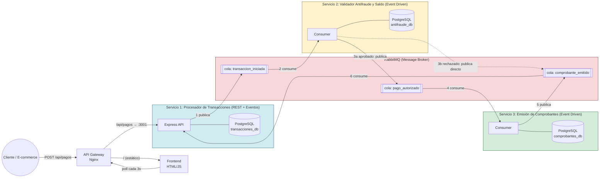

# Proyecto Final: Aplicaciones Distribuidas - Pasarela de Pagos (Fintech)

**Grupo 3**
- Andrea Navia Marín
- Cristina Cortez Escobar
- Pablo Varas Burgos
- Joshua Jara Herrera

---

## Stack Tecnológico

- **Servicios (x3):** Node.js + Express (`node:18-alpine`)
- **Bases de Datos (x3):** PostgreSQL (`postgres:15-alpine`)
- **Message Broker:** RabbitMQ (`rabbitmq:3-alpine`)
- **API Gateway:** Nginx (`nginx:alpine`)
- **Frontend:** HTML + JavaScript
- **Orquestación:** Kubernetes / K3s
- **CI/CD:** GitHub Actions (develop → QA / main → PROD)
- **Desarrollo Local:** Docker Compose

---

## 1. Diagrama Arquitectónico

A continuación se detalla el flujo asíncrono y la independencia de bases de datos de la pasarela de pagos:



**Camino del mensaje:**
1. El cliente envía el pago por REST al Gateway, que lo enruta al Servicio 1.
2. Servicio 1 valida el formato, guarda la transacción en `EN_PROCESO` en su propia base de datos y responde `202` de inmediato (no espera al resto del flujo).
3. Servicio 1 publica `transaccion_iniciada` en RabbitMQ.
4. Servicio 2 consume el evento, valida tarjeta/CVC/saldo contra su propia base de datos y publica `pago_autorizado` (o, si falla, publica `comprobante_emitido` con estado `rechazado` directamente, saltándose al Servicio 3).
5. Servicio 3 consume `pago_autorizado`, genera un folio contable único en su propia base de datos y publica `comprobante_emitido`.
6. Servicio 1 consume `comprobante_emitido` y actualiza el estado final de la transacción. El frontend hace polling cada 3 s sobre el Gateway y refleja el cambio de estado sin que el cliente vuelva a interactuar.

Ningún servicio consulta la base de datos de otro: toda coordinación entre Servicio 1 ↔ Servicio 2 ↔ Servicio 3 pasa exclusivamente por las colas de RabbitMQ.

---

## 2. Contrato de Datos (Eventos JSON en RabbitMQ)

Para garantizar la comunicación asíncrona, los microservicios intercambiarán los siguientes eventos por las colas del broker:

**Evento A: `transaccion_iniciada` (S1 -> S2)**
```json
{
  "id_transaccion": "tx-987654321",
  "fecha_hora": "2026-06-17T14:30:00Z",
  "datos_pago": {
    "monto": 25000,
    "moneda": "CLP",
    "tarjeta_numero": "123456789012",
    "cvc": "123"
  }
}
```

**Evento B: `pago_autorizado` (S2 -> S3)**
```json
{
  "id_transaccion": "tx-987654321",
  "estado_validacion": "aprobado",
  "motivo": "Fondos suficientes y validación de seguridad exitosa",
  "monto_validado": 25000
}
```

**Evento C: `comprobante_emitido` (S3 -> S1 / Frontend)**
```json
{
  "id_transaccion": "tx-987654321",
  "folio_contable": "FC-1029384756",
  "estado_final": "completado",
  "mensaje": "El dinero ha sido legalmente procesado."
}
```

---

## 3. Guía de Configuración de Acceso

El sistema se enruta por nombre de dominio, no por IP:puerto. Los Ingress del clúster resuelven:

| Entorno | Dominio | Namespace |
|---|---|---|
| QA | `qa.grupo3.uta.cl` | `grupo3-qa` |
| PROD | `prod.grupo3.uta.cl` | `grupo3-prod` |

**Opción A — sin tocar nada (recomendada para el evaluador):**
Usar los dominios `nip.io`, que son DNS público y resuelven solos a la IP de la VM:
- QA: `http://qa.grupo3.146.83.102.22.nip.io`
- PROD: `http://prod.grupo3.146.83.102.22.nip.io`

**Opción B — usando los dominios oficiales `.uta.cl`:**
Requiere agregar una entrada al archivo `hosts` de la máquina del evaluador para que resuelva contra la VM del grupo (`146.83.102.22`).

*Windows (PowerShell como administrador):*
```powershell
Add-Content -Path "$env:WINDIR\System32\drivers\etc\hosts" -Value "146.83.102.22 qa.grupo3.uta.cl prod.grupo3.uta.cl"
```

*Linux / macOS:*
```bash
echo "146.83.102.22 qa.grupo3.uta.cl prod.grupo3.uta.cl" | sudo tee -a /etc/hosts
```

Luego basta con abrir `http://qa.grupo3.uta.cl` o `http://prod.grupo3.uta.cl` en el navegador (sin puertos, sin IP visible).

---

## 4. Manual Operativo de Control

Todos los comandos usan `kubectl` (o `k3s kubectl`) contra el namespace del entorno (`grupo3-qa` o `grupo3-prod`).

**Estado unificado del sistema:**
```bash
# Estado de todos los pods (los 3 servicios, gateway, frontend, broker y BDs)
kubectl get pods -n grupo3-qa -o wide

# Logs de un servicio puntual
kubectl logs -f deploy/servicio-2-validador -n grupo3-qa

# Logs de TODOS los pods de un mismo tier a la vez (vista unificada básica)
kubectl logs -f -l app=servicio-1-procesador -n grupo3-qa --all-containers --prefix

# Estado de las colas y consumidores en RabbitMQ
kubectl port-forward svc/rabbitmq 15672:15672 -n grupo3-qa
# luego abrir http://localhost:15672 (admin / admin123)

# Rutas de dominio activas
kubectl get ingress -n grupo3-qa

# Vista unica de logs de TODOS los contenedores (Grafana + Loki, ver mas abajo)
kubectl get pods -l 'app in (loki,promtail,grafana)' -n grupo3-qa
```

**Historial Centralizado (Loki + Promtail + Grafana):**
Promtail corre como DaemonSet (un pod por nodo) y envía los logs de todos los pods de `grupo3-qa`/`grupo3-prod` a Loki, filtrando por namespace para no capturar logs de otros grupos que comparten el mismo nodo. Grafana consulta Loki como fuente única.
```bash
# Exponer el panel localmente
kubectl port-forward svc/grafana 3000:3000 -n grupo3-qa
# abrir http://localhost:3000 (acceso anónimo de solo lectura) -> Explore -> datasource "Loki"
# consulta de ejemplo: {namespace=~"grupo3-qa|grupo3-prod"}
```

**Certificar el almacenamiento persistente de las copias de seguridad:**
```bash
# El CronJob corre cada 10 minutos: confirmar que existe y su última ejecución
kubectl get cronjob backup-databases -n grupo3-qa
kubectl get jobs -n grupo3-qa

# El PVC "backups" debe existir y tener los .sql más recientes
kubectl get pvc backups -n grupo3-qa

# Disparar un respaldo manual y revisar el listado de archivos generado
kubectl create job --from=cronjob/backup-databases backup-manual -n grupo3-qa
kubectl logs job/backup-manual -n grupo3-qa
```

**Pruebas de resiliencia (lo que ejecuta el docente en la defensa en vivo):**
```bash
# Matar un pod de servicio: Kubernetes lo recrea solo (self-healing)
kubectl delete pod -l app=servicio-1-procesador -n grupo3-qa
kubectl get pods -n grupo3-qa -w

# Matar una base de datos: los datos sobreviven porque viven en el PVC
kubectl delete pod -l app=db-svc3 -n grupo3-qa
kubectl get pods -n grupo3-qa -w
```

Ver también [k8s/README.md](k8s/README.md) para el detalle de despliegue manifiesto por manifiesto.